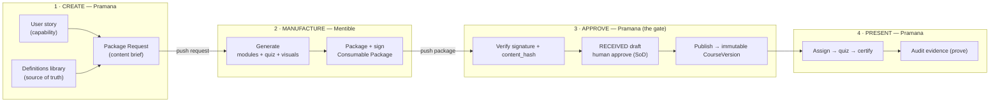

# User Stories — Index & Conventions

**Document type:** Master index + authoring conventions for product user stories
**Scope:** GRC (Governance, Compliance, Regulations) training & tracking across
multiple industries.

> ⚠️ **Disclaimer:** These stories describe how the product should *support*
> each framework's training obligations. They are engineering/product artifacts,
> **not legal advice**. Regulatory interpretation must be confirmed with the
> customer's compliance counsel before any framework becomes a binding commitment.

---

## Mental model — Create → Manufacture → Approve → Present

At the highest level there are **four phases**, and the two product boundaries are
**artifact handoffs** (a *Package Request* out, a *Consumable Package* back), per
Mentible ADR-011:

1. **Create** *(Pramana)* — say **what** is needed: the regulation's truth (the
   **definitions library**, `docs/frameworks/*`) plus a **Package Request** distilled
   from a **user story**.
2. **Manufacture** *(Mentible)* — make the **thing**: generate + package the
   **Consumable Package** (modules + quiz + visuals + EPUB3/PDF), signed and
   provenance-stamped.
3. **Approve** *(Pramana — the gate)* — verify signature + `content_hash`, hold it as
   an untrusted `RECEIVED` draft until a **human approves** it (separation of duties),
   then publish to an immutable `CourseVersion`. *Manufactured content never reaches a
   learner un-approved — "the AI wrote it" is not a defence.*
4. **Present** *(Pramana)* — assign → quiz → certify → **prove** (audit evidence).



> **Vocabulary:** "story" is used in two senses — the **user story** (a Pramana
> product-capability *spec*, the artifacts in this folder) and the **training
> narrative** Mentible manufactures and Pramana presents (the *Consumable Package*).
> The user story is the spec; the package is the presentation.

---

## 1. How this is organized

Stories are filed **framework-first** — one folder per regulation/standard —
mirroring [`docs/frameworks/`](../frameworks/regulatory_frameworks_index.md). A
single regulation (e.g. FCPA) is simultaneously a *regulation*, a *compliance*
obligation, and a *governance* concern, and it spans industries — so **domain**
and **industry** are recorded as story metadata, not as folders. This keeps each
story in exactly one home while staying filterable across every dimension.

```
docs/user-stories/
  README.md                ← this file (conventions, ID scheme, vocab)
  _templates/
    user-story.md          ← copy this to start a new story
    package-request.md     ← how a story becomes a Mentible generation request
  <framework>/             ← e.g. fcpa/  sox/  hipaa/  gdpr/  iso27001/  pci-dss/
    README.md              ← the framework "epic": scope, personas, story index
    US-<CODE>-NNNN-<slug>.md
    briefs/                ← Package Requests (Pramana → Mentible) for this framework
      PR-<CODE>-<slug>.jsonc
```

## 2. ID scheme

`US-<FRAMEWORK_CODE>-NNNN`

- `US` — user story.
- `FRAMEWORK_CODE` — short upper-case framework code (`FCPA`, `SOX`, `HIPAA`,
  `GDPR`, `ISO27001`, `PCIDSS`).
- `NNNN` — zero-padded sequence, unique **within the framework**, never reused.

Cross-framework stories (a capability that serves several frameworks) are filed
under their **primary** framework and list the others in `also_satisfies`.

**`PLATFORM`** is a reserved non-framework code for **cross-cutting product
surfaces** (the library, player, commissioning, and review/approval UIs) that serve
*every* framework. They live under [`platform/`](platform/README.md) and use
`framework: platform`.

## 3. Story metadata (YAML front-matter)

Every story begins with this block. Controlled vocabularies are listed in §4.

```yaml
---
id: US-FCPA-0001
title: Short imperative title
framework: fcpa
domain: [compliance, regulatory]      # any of: governance | compliance | regulatory
industries: [cross-industry]          # see §4; cross-industry if broadly applicable
persona: compliance-officer           # the primary actor (see §4)
priority: must                        # MoSCoW: must | should | could | wont
status: draft                         # draft | ready | in_progress | done | deferred
also_satisfies: [sox]                 # other frameworks this story helps cover (optional)
traces_to:                            # provenance: ADRs, specs, FRs, framework clauses
  - docs/03_ai_drafted_human_approved_content.md
  - ADR-011
---
```

## 4. Controlled vocabularies

**domain** — `governance` · `compliance` · `regulatory`
**priority** (MoSCoW) — `must` · `should` · `could` · `wont`
**status** — `draft` · `ready` · `in_progress` · `done` · `deferred`

**persona** (the actor in *"As a …"*):

| Slug | Who |
|---|---|
| `compliance-officer` | Chief Compliance Officer / compliance admin — owns the program |
| `employee` | Trainee assigned mandatory training |
| `manager` | People-manager accountable for their team's completion |
| `content-author` | SME who authors/approves training content (the ADR-011 approver) |
| `third-party-manager` | Procurement / vendor owner managing intermediaries & partners |
| `auditor` | Internal or external auditor / regulator with read access to evidence |
| `governance-board` | Board / audit-committee member with oversight responsibility |

**industries** — `cross-industry` (default) · `financial-services` · `energy` ·
`healthcare` · `life-sciences` · `technology` · `manufacturing` · `defense` ·
`public-sector` · `retail` (extend as needed).

## 5. Story body structure

Each story uses INVEST-friendly sections (see the template):
1. **Story** — *As a `<persona>`, I want `<capability>`, so that `<outcome>`.*
2. **Context** — why this matters for the framework (1–2 paragraphs).
3. **Acceptance criteria** — Given/When/Then, numbered and testable.
4. **Out of scope / notes** — explicit boundaries, dependencies.
5. **Traceability** — links back to ADRs, specs, FRs, and framework clauses.

## 6. From story to training content (Mentible)

A story is a **product capability**; the training *content* it relies on is
generated by **Mentible** and ingested via the ADR-011 `consumer_library`. To
commission that content, extract a story's content/assessment criteria into a
**Package Request** (`<framework>/briefs/`) — see
[`_templates/package-request.md`](_templates/package-request.md). The request's
`source_definitions` must reference real clause anchors in
[`docs/frameworks/`](../frameworks/regulatory_frameworks_index.md). Mentible emits a
signed package → Pramana verifies + a human approves (the `*-0005` story) →
publish → the story's delivery criteria operate on the published course.

## 7. Framework index

| Framework | Code | Folder | Status |
|---|---|---|---|
| _Platform (cross-cutting surfaces)_ | `PLATFORM` | [`platform/`](platform/README.md) | 🚧 In progress |
| Foreign Corrupt Practices Act | `FCPA` | [`fcpa/`](fcpa/README.md) | 🚧 In progress |
| Sarbanes-Oxley | `SOX` | [`sox/`](sox/README.md) | 🚧 In progress |
| HIPAA | `HIPAA` | [`hipaa/`](hipaa/README.md) | 🚧 In progress |
| GDPR | `GDPR` | [`gdpr/`](gdpr/README.md) | 🚧 In progress |
| ISO 27001 | `ISO27001` | _planned_ | — |
| PCI DSS | `PCIDSS` | _planned_ | — |

---

*To add a framework: create `<framework>/README.md` (epic) from an existing one,
add a row above, and start numbering stories at `0001`.*
